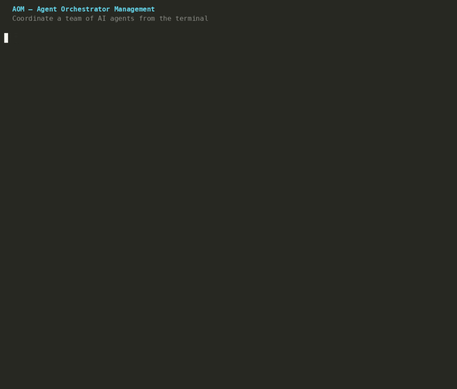
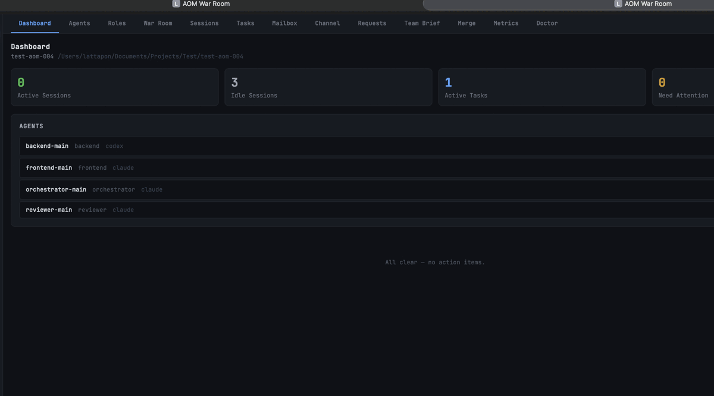

# AOM — Agent Orchestrator Management

[](LICENSE)
[](https://golang.org)
[](#installation)

**Run your AI agents as a real engineering team.**

Claude Code, Codex, Kiro — each running natively in its own terminal, working in parallel on the same project, communicating through a shared channel, isolated in their own git branches. AOM coordinates them all from one place.

## The Problem AOM Solves

If you've run multiple AI agents on the same project, you know the drill:

- **Sessions crash and lose context** — you re-paste the prompt, re-explain the task, hope it picks up where it left off
- **No unified view** — to know what's happening, you switch terminals one by one
- **Agents can't talk to each other** — Agent B needs what Agent A found; you relay it manually, every time
- **Two agents, same file** — conflict you didn't see coming, with no way to know it was happening
- **Handoffs are invisible** — the builder finishes, but the reviewer never finds out unless you tell it
- **Step away for an hour** — come back to frozen terminals, blocked agents, or work that quietly went sideways

The agents are capable. The problem is the **coordination layer above them** — state, communication, task routing, handoffs, git isolation, operator workflow. That layer doesn't exist natively, so you end up becoming it.

**AOM is that layer.**

## Demo

**CLI** — `aom status`, team channel, and the tiled team view



**Web Dashboard** — `aom serve` opens a browser UI with live terminal panes, task management, and agent profile editor



> Dashboard → Agents → Roles & Classes → Sessions → Tasks → Channel → Mailbox → War Room

## How It Works

AOM runs each agent's **native CLI** (`claude`, `codex`, `kiro`, …) inside a dedicated **tmux session**. No API wrapping — the agent runs at full capability exactly as its vendor designed it.

```
┌──────────────────────────────────────────────────────┐
│  tmux  (one session per agent)                        │
│  ┌────────────────┐  ┌────────────────┐              │
│  │ claude (pane)  │  │ codex  (pane)  │  …           │
│  │ native CLI     │  │ native CLI     │              │
│  └────────────────┘  └────────────────┘              │
└──────────────────────────────────────────────────────┘
          ▲  reads task + profile        ▲
          │  posts to channel            │
     .agent/*.md  ←──── aom CLI ────→  .aom/channel.md
                        (coordinator)
```

AOM coordinates through the **filesystem** — writing task context, role profiles, and shared channel files that agents read. State is durable Markdown: it survives crashes, restarts, and agent replacements.

**The system is layered and decoupled:**

```
  Web UI  (React + xterm.js)   ← optional — browser view
  REST API  (aom serve)        ← HTTP interface to the same state
  aom CLI  (core)              ← the real control plane, fully standalone
  tmux + native agent CLIs     ← where agents actually run
  Your project codebase        ← the work being done
```

Remove the web UI — agents keep running. Remove the API — the CLI still works. The CLI is the source of truth.

## Quick Start

### Single agent — up in 4 commands

```bash
cd your-project
aom project init "my-project"
aom agent add builder --role builder --class builder --runtime claude
aom agent provision builder
aom session spawn builder --real
# → Claude Code opens with full AOM context injected
```

### Full team — mix Claude Code + Codex

```bash
cd your-project
aom project init "my-project"

aom agent add orchestrator --role orchestrator --class orchestrator --runtime claude
aom agent add backend      --role builder      --class builder      --runtime codex
aom agent add frontend     --role builder      --class frontend     --runtime claude
aom agent add reviewer     --role reviewer     --class reviewer     --runtime claude

aom agent provision orchestrator
aom agent provision backend
aom agent provision frontend
aom agent provision reviewer

aom orchestrate --real
# → Spawns the team in a tiled tmux layout
# → Tell the orchestrator what to build — it assigns tasks and coordinates
```

Monitor from another terminal:

```bash
aom status             # project-wide overview
aom channel read       # shared team log
aom dashboard          # live ANSI dashboard (Ctrl+C to exit)
```

> **macOS tip:** [iTerm2](https://iterm2.com) with `tmux -CC` gives each agent its own native pane in a single window — the most ergonomic way to watch the team. See [docs/iterm2-tmux-setup.md](docs/iterm2-tmux-setup.md).

## How You Can Run It

### Option A — Operator as Orchestrator

Run `aom` commands directly to dispatch tasks, monitor workers, and manage handoffs. Best for structured pipelines, sequential handoffs, and strict oversight.

### Option B — AI Orchestrator

Spawn a Claude session with `role: orchestrator` and let it manage the team — reading artifacts, assigning tasks, sending messages. You only step in for approvals. Best for long-running parallel work.

### Option C — Free-Roam Workspace

Each agent has a permanent workspace branch. Walk freely between terminals. AOM is the communication backbone. Best for exploratory work and direct feedback loops.

## Features

### 🗂 Task & Session Management
- Full task lifecycle: Draft → Ready → InProgress → Done, with step-level granularity
- Sessions always resumable — context survives crashes, restarts, and reconnects via durable Markdown artifacts
- Per-task git worktree isolation — each task gets its own branch; agents never collide on the same files
- `aom session recover` — diagnoses stuck sessions and recommends the right action
- `aom task verify` — gates acceptance on tagged commit + handoff.md + log event checks

### 💬 Agent Communication
- **Shared channel** — all agents post to a team log; operator reads with `aom channel read`
- **Direct messages** — targeted prompts with instant notification; `aom message watch` exits when reply arrives
- **Broadcast** — push a brief to every live agent in one command (`aom broadcast --file brief.md`)
- **Mailbox** — per-agent inbox for async coordination; fully visible in the Web UI

### 🎭 Agent Profiles & Roles
- **Three-zone profile system**: Zone A (AOM Workflow Protocol, embedded) + Zone B (role class, project-editable) + Zone C (per-agent custom instructions)
- Built-in classes: `builder`, `frontend`, `reviewer`, `orchestrator`, `generic`
- Unlimited custom classes — define role templates for any domain
- Live profile preview — see the exact prompt your agent receives before spawning

### ⚙️ Operator Workflow
- Approval gates — agents request, operator approves or denies
- Handoff protocol — structured context transfer between agents; `handoff.md` auto-routed
- Merge pipeline — `aom merge check / prepare / commit` with tagged-commit verification
- `aom run-pipeline <task-id>` — automated: spawn → wait → verify → accept → merge
- `aom task accept --auto` — polls until all checks pass, then auto-accepts

### 🖥 Web Dashboard (`aom serve`)
- **Embedded** in the binary — no npm in production, no separate install
- **War Room** — live xterm.js terminal panes for every active agent session
- **Roles & Classes** — edit agent profiles from the browser with live preview
- **Agent panel** — 3-tab editor per agent: Custom Instructions / Role Template / System Template
- **Dashboard** — inline Approve / Deny / Accept / Spawn action items, Pause All / Resume All
- Full CRUD for tasks, sessions, requests, team brief, merge flow, metrics, and health checks

### 🛡 Safety & Observability
- Policy enforcement — deny-command wrappers block forbidden shell commands at the pane level
- `aom doctor` — checks git identity, PATH, DB permissions, workspace state, WSL2 config
- One-writer guardrail — second session on the same worktree is blocked by default
- SQLite WAL mode + 30s busy timeout — no write contention across concurrent sessions

### 🔌 Multi-Runtime
- Claude Code and Codex CLI — fully supported, E2E tested, cross-provider pipeline verified
- WSL2-compatible — automatic bwrap bypass for Codex on WSL2, no config needed
- Runtime adapter pattern — one file in `internal/provider/` to add a new CLI agent

## Architecture

### Native CLI harness — not an API wrapper

Most multi-agent frameworks call provider APIs. AOM runs each agent's **native CLI** in a tmux pane. The agent uses its own tool execution, file access, and context management — exactly as its vendor designed. AOM doesn't sit in the call path.

**AOM as connector:**

| What AOM does | How |
|---|---|
| Assigns tasks to agents | Writes `task.md` + sends to agent mailbox |
| Isolates parallel work | Per-agent git worktree on its own branch |
| Routes communication | Shared channel + per-agent mailbox (Markdown files) |
| Detects completion | Monitors tmux pane output for lifecycle signals |
| Coordinates handoffs | Auto-copies `handoff.md` from builder → reviewer |
| Manages merges | Tagged-commit check + three-step merge pipeline |

**Three layers of truth** (highest authority first):
1. **`.agent/*.md` artifacts** — task.md, state.md, log.md, handoff.md — survives crashes
2. **SQLite DB** (`.aom/sessions.db`) — structured state for queries
3. **Live tmux sessions** — ephemeral, always replaceable

See [docs/state-machine.md](docs/state-machine.md) for full lifecycle diagrams.

## Design Philosophy

**Local-first** — everything lives in `.aom/` inside your project. No cloud account, no sync daemon. `.agent/*.md` artifacts are plain Markdown you can read, diff, and commit. If AOM disappears, your project stays intact.

**Workspace-first** — scoped to one repo. One `aom project init`. Every agent, task, session, and artifact belongs to that workspace. Git worktrees keep parallel work isolated.

**Operator-in-control** — nothing mutates hidden state. Every transition is explicit: tasks have approval gates, sessions have lifecycle commands, merges have a three-step pipeline. The operator drives.

**Runtime-agnostic** — Claude Code, Codex, Kiro, Antigravity — they all spawn the same way. Switching runtimes per agent is one flag at registration time.

## Requirements

- **tmux** — session management (required)
- **git** — worktree isolation (required)
- At least one agent runtime: [Claude Code](https://claude.ai/code), [Codex CLI](https://github.com/openai/codex), or Kiro

## Installation

### macOS / Linux

```bash
curl -fsSL https://raw.githubusercontent.com/lattapon-aek/agent-orchestrator-management/main/scripts/get.sh | sh
```

### macOS — Homebrew

```bash
brew install lattapon-aek/tap/aom-agents
```

> The formula is named `aom-agents` to avoid conflict with the [AV1 video codec](https://formulae.brew.sh/formula/aom) in homebrew/core. The installed binary is still named `aom`.

To upgrade:

```bash
brew upgrade aom-agents
```

### Windows (WSL2)

```bash
# In a WSL2 terminal
curl -fsSL https://raw.githubusercontent.com/lattapon-aek/agent-orchestrator-management/main/scripts/get.sh | sh
```

### Build from source (Go 1.24+)

```bash
git clone https://github.com/lattapon-aek/agent-orchestrator-management.git
cd agent-orchestrator-management
./scripts/install.sh
```

```bash
aom version   # verify
```

## Key Commands

```bash
# Project setup
aom project init          # init AOM in current repo
aom agent add             # register an agent
aom agent provision       # create permanent workspace
aom doctor                # check system health

# Run the team
aom orchestrate --real    # spawn full team in tiled tmux layout
aom session spawn         # spawn a single agent session
aom switch <name>         # jump to agent's tmux pane
aom team view             # attach to team window

# Monitor
aom status                # project-wide summary
aom status --action-items # only items needing operator action
aom dashboard             # live ANSI terminal dashboard
aom channel read          # team communication log
aom events tail           # stream live log events

# Tasks
aom task create           # create a task
aom task list             # list all tasks
aom task verify <id>      # run completion checks
aom task accept <id>      # accept for merge
aom next                  # highest-priority ready task

# Communicate
aom message send <agent>  # direct message to an agent
aom broadcast "<text>"    # push to all live agents
aom channel append        # post to shared team channel

# Merge
aom merge check           # check readiness
aom merge prepare         # prepare merge plan
aom merge commit          # commit verified work to main
aom run-pipeline <id>     # automated: spawn → verify → accept → merge
```

Full command reference: [docs/cli-spec.md](docs/cli-spec.md)

## Web Dashboard

```bash
aom serve           # http://localhost:7777
aom serve --port 8080
```

| View | What it shows |
|------|--------------|
| **Dashboard** | Team overview, action items (Approve / Accept / Spawn), Pause All |
| **War Room** | Live xterm.js terminal for every active session |
| **Agents** | Edit custom instructions, role template, and system template per agent |
| **Roles** | Create / edit / preview role classes; override built-in templates |
| **Sessions** | Spawn, stop, recover |
| **Tasks** | Search, filter, view artifacts |
| **Channel** | Live event stream |
| **Mailbox** | Send messages, broadcast |
| **Merge** | Check → Prepare → Commit flow |
| **Metrics** | Velocity from task/step events |
| **Doctor** | Environment health checks |

## Supported Runtimes

| Runtime | Status | Notes |
|---------|--------|-------|
| Claude Code (`claude`) | ✅ Stable | Full support — workspace isolation, policy enforcement |
| Codex CLI (`codex`) | ✅ Stable | Full support — WSL2 bwrap bypass, deny-command wrappers |
| Kiro CLI (`kiro`) | 🔜 Planned | Pending confirmed CLI flags |
| Antigravity CLI | 🔜 Planned | Google's agent CLI — pending confirmed CLI flags |
| OpenClaw | 🗓 Future | On the roadmap |
| Hermes | 🗓 Future | On the roadmap |

Adding a new runtime = one file in `internal/provider/`. See [docs/engineering-guidelines.md](docs/engineering-guidelines.md).


### 🤖 Agent Task Runner (Review Loop)

For complex tasks that need quality review, AOM delegates to **agent-task-runner** 
(`loop_kit`) — a Python package that runs a PM→Worker→Reviewer loop:

```bash
# Direct invocation
aom pipeline-loop <task-id>

# Or via session spawn (auto-routes when agent.Runtime == "agent-task-runner")
aom session spawn my-agent --task <id>
```

**How it works:**

```
AOM pipeline-loop
  → generates task_card.json from AOM task record
  → provisions git worktree for isolation
  → invokes: python -m loop_kit run --auto-dispatch --outcome-file ...
  → Worker (opencode) writes code → Reviewer (opencode) validates
  → reads outcome.json → maps to AOM task status
```

**Outcome → Status Mapping:**

| Outcome | AOM Status |
|---------|-----------|
| `approved` | Done (task close) |
| `no_change_success` | Done (task close) |
| `validation_failure`, `config_error`, `state_error` | NeedsAttention |
| `timeout`, `interrupted`, `max_rounds_exhausted`, `dirty_worktree`, `lock_failure` | Blocked |

**PM Sync:** After updating AOM's local task status, `pipeline-loop` also calls
`pm_outcome_handler.py` to sync the outcome back to the Project Management system.

**Files:** `internal/provider/agent_task_runner.go`, `internal/cli/pipeline_loop.go`\
**Docs:** [agent-task-runner integration spec](https://github.com/zxkjack123/agent-task-runner/blob/master/docs/integration-spec.md)


## Roadmap

### 🔜 Up Next
- Kiro and Antigravity CLI adapters
- Web UI: dark/light mode, visual polish
- Web UI: task graph view — visualize dependency chains
- Web UI: real-time push notifications

### 🗓 Planned
- **Orchestrator Agent Mode** — delegate the operator role to an AI session; human only approves
- Project templates — `aom project init --template web-app` with pre-configured teams
- Web UI: War Room multi-layout for large teams
- **Scheduled Jobs (`aom cron`)** — per-project cron jobs that fire prompts to agents on a schedule; see concept below

### 💡 Vision
- Agent marketplace — shareable role templates the community can publish
- Cross-project coordination — one operator, multiple repos
- Mobile companion — approve actions and read the channel from a phone

---

## Concept: Scheduled Jobs

> **Status: planned — not yet implemented.**

Per-project cron jobs that automatically fire a prompt to one agent, a role group, or the whole team on a schedule — no human required.

```yaml
# .aom/jobs.yaml
jobs:
  - id: morning-standup
    schedule: "0 9 * * 1-5"   # Mon–Fri 9 am
    target: all               # broadcast to whole team
    message: "Good morning. Check aom status and report your task to the channel."
    enabled: true

  - id: hourly-research
    schedule: "0 * * * *"
    target: agent:researcher-main
    message: "Any new developments on your research topic? Update state.md if yes."
    enabled: true
```

Works without `aom serve` — a lightweight `aom cron` daemon runs independently in the background. When you do open the web UI, you can manage jobs from there too.

## Documentation

| File | Covers |
|------|--------|
| [docs/AOM-planning.md](docs/AOM-planning.md) | Product vision and operating principles |
| [docs/state-machine.md](docs/state-machine.md) | Full lifecycle for Task, Step, Session, Worktree |
| [docs/cli-spec.md](docs/cli-spec.md) | Complete CLI and REST API reference |
| [docs/artifact-schemas.md](docs/artifact-schemas.md) | Markdown artifact contracts |
| [docs/project-config.md](docs/project-config.md) | `.aom/` config file reference |
| [docs/iterm2-tmux-setup.md](docs/iterm2-tmux-setup.md) | iTerm2 + tmux -CC setup guide |
| [docs/engineering-guidelines.md](docs/engineering-guidelines.md) | Code style and design guardrails |

## Support the Project

AOM is independent open source — no VC, no SaaS, no enterprise edition. Everything here is free and stays free.

If AOM saves you coordination time, consider:

- ⭐ **Star the repo** — helps others discover it
- 🐛 **Report bugs** — real usage reports are the most valuable contribution
- 💬 **Share feedback** — open an issue with what's working and what isn't
- 💖 **[Sponsor](https://github.com/sponsors/lattapon-aek)** — funds new runtime adapters, Web UI improvements, and cross-platform testing

## Contributing

Contributions welcome. Read [AGENTS.md](AGENTS.md) before submitting a PR.

## License

[MIT](LICENSE)
